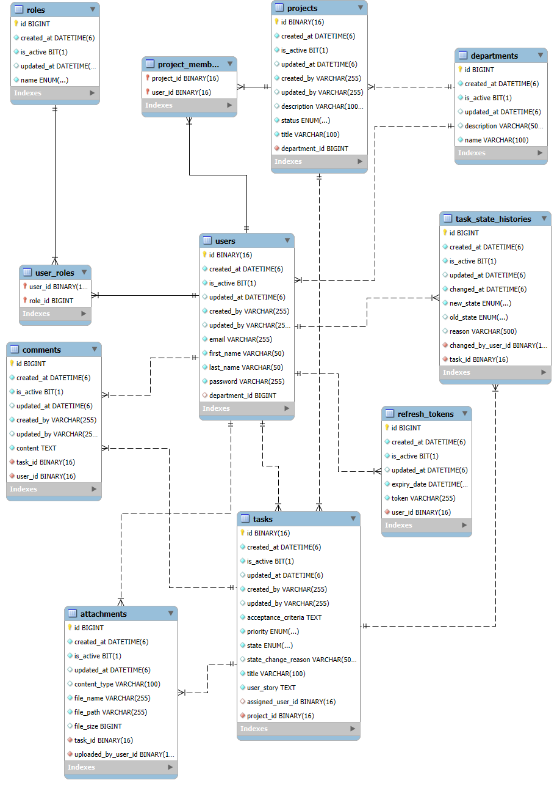

# Advanced Task Manager

## Overview
The Advanced Task Manager is a modern, robust task management system built for Lorem Ipsum Corporation. This application replaces the outdated, slow legacy system with a high-performance solution that meets the company's current and future needs. The system enables efficient project management, task tracking, team collaboration, and comprehensive reporting.

## Table of Contents
- [Features](#features)
- [Technology Stack](#technology-stack)
- [System Architecture](#system-architecture)
- [Database Schema](#database-schema)
- [Security and Permissions](#security-and-permissions)
- [API Endpoints](#api-endpoints)
- [Task State Workflow](#task-state-workflow)
- [Installation and Setup](#installation-and-setup)
- [API Testing with Postman](#api-testing-with-postman)
- [Usage Examples](#usage-examples)

## Features

### Project Management
- Create and manage projects associated with specific departments
- Track project status (In Progress, Cancelled, Completed)
- Manage project teams with role-based permissions
- Generate comprehensive project reports

### Task Management
- Create detailed tasks with user stories and acceptance criteria
- Assign tasks to team members
- Track task progress through predefined workflow states
- Set and update task priorities
- Comment on tasks for team collaboration
- Attach files to tasks for documentation

### User Management
- Role-based access control
- Department-specific permissions
- Secure authentication with JWT
- Password encryption
- Refresh token mechanism

### Reporting and Analytics
- Task status overview
- Priority distribution
- User workload analysis
- Project progress tracking
- State transition history

## Technology Stack

- **Backend**: Java 21, Spring Boot 3
- **Database**: MySQL
- **Security**: Spring Security, JWT
- **Data Access**: Spring Data JPA
- **API Documentation**: Swagger/OpenAPI
- **Testing**: JUnit, Mockito
- **Utilities**: Lombok, MapStruct
- **Validation**: Spring Boot Validation
- **Development**: Spring Boot DevTools

## System Architecture

The application follows a layered architecture pattern:

1. **Controller Layer**: Handles HTTP requests and responses
2. **Service Layer**: Contains business logic and transactions
3. **Repository Layer**: Manages data access operations
4. **Model Layer**: Defines entities, DTOs, and enums
5. **Security Layer**: Manages authentication and authorization
6. **Exception Layer**: Provides global exception handling

## Database Schema

The system uses a relational database with the following core entities:



### Core Entities
- **Users**: System users with different roles
- **Roles**: User role definitions (Admin, Project Group Manager, etc.)
- **Departments**: Organizational departments
- **Projects**: Project information and metadata
- **Tasks**: Core task entities with all task-related information
- **Comments**: Task-related comments for collaboration
- **Attachments**: Files attached to tasks
- **Task State Histories**: State transition tracking for auditing
- **Refresh Tokens**: JWT refresh token management

## Security and Permissions

The application implements a comprehensive role-based security model:

### User Roles

- **Admin**:
  - Full access to all system features
  - Can manage all departments, projects, and users
  - Can perform all CRUD operations across the system

- **Project Group Manager**:
  - Can manage all projects and tasks across departments
  - Can assign team members to projects
  - Can view and generate reports for all projects

- **Project Manager**:
  - Can manage projects and tasks within their department
  - Can assign team members to tasks in their projects
  - Can create, update, and delete tasks within their department

- **Team Leader**:
  - Can manage projects and tasks within their department
  - Can assign team members to tasks in their projects
  - Can create, update, and delete tasks within their department

- **Team Member**:
  - Can view assigned tasks and their details
  - Can update task state, add comments, and manage attachments
  - Cannot modify task titles or descriptions

### Permission Rules

- **Department-Based Access**: Users can only access projects and tasks in their departments (except for Admin and Project Group Manager)
- **Soft Delete**: Records are never physically deleted, only marked as inactive
- **Task State Transitions**: Strictly controlled based on workflow rules
- **Data Validation**: Comprehensive input validation at all levels

## API Endpoints

The application exposes RESTful APIs for various operations:

### Authentication
- `POST /api/auth/register`: Register a new user
- `POST /api/auth/login`: User login
- `GET /api/auth/me`: Get current user information
- `POST /api/auth/refresh-token`: Refresh access token
- `POST /api/auth/logout`: User logout

### Users
- `GET /api/users`: Get all users
- `GET /api/users/{id}`: Get user by ID
- `GET /api/users/by-email/{email}`: Get user by email
- `GET /api/users/by-department/{departmentId}`: Get users by department
- `GET /api/users/by-role/{role}`: Get users by role
- `POST /api/users`: Create a new user
- `PUT /api/users/{id}`: Update user
- `PUT /api/users/{id}/roles`: Update user roles
- `DELETE /api/users/{id}`: Delete user (soft delete)

### Departments
- `GET /api/departments`: Get all departments
- `GET /api/departments/{id}`: Get department by ID
- `GET /api/departments/by-name/{name}`: Get department by name
- `POST /api/departments`: Create a new department
- `PUT /api/departments/{id}`: Update department
- `DELETE /api/departments/{id}`: Delete department (soft delete)

### Projects
- `GET /api/projects`: Get all projects
- `GET /api/projects/{id}`: Get project by ID
- `GET /api/projects/department/{departmentId}`: Get projects by department
- `GET /api/projects/status/{status}`: Get projects by status
- `GET /api/projects/team-member/{userId}`: Get projects by team member
- `POST /api/projects`: Create a new project
- `PUT /api/projects/{id}`: Update project
- `PATCH /api/projects/{id}/status`: Update project status
- `POST /api/projects/{projectId}/team-members/{userId}`: Add user to project
- `DELETE /api/projects/{projectId}/team-members/{userId}`: Remove user from project
- `DELETE /api/projects/{id}`: Delete project (soft delete)

### Tasks
- `GET /api/tasks`: Get all tasks
- `GET /api/tasks/{id}`: Get task by ID
- `GET /api/tasks/project/{projectId}`: Get tasks by project
- `GET /api/tasks/assigned-user/{userId}`: Get tasks by assigned user
- `GET /api/tasks/state/{state}`: Get tasks by state
- `GET /api/tasks/priority/{priority}`: Get tasks by priority
- `POST /api/tasks`: Create a new task
- `PUT /api/tasks/{id}`: Update task
- `PATCH /api/tasks/{id}/state`: Update task state
- `POST /api/tasks/{taskId}/assign/{userId}`: Assign task to user
- `POST /api/tasks/{taskId}/unassign`: Unassign task
- `DELETE /api/tasks/{id}`: Delete task (soft delete)

### Comments
- `GET /api/comments/{id}`: Get comment by ID
- `GET /api/comments/task/{taskId}`: Get comments by task
- `GET /api/comments/user/{userId}`: Get comments by user
- `POST /api/comments`: Create a new comment
- `PUT /api/comments/{id}`: Update comment
- `DELETE /api/comments/{id}`: Delete comment (soft delete)

### Attachments
- `GET /api/attachments/{id}`: Get attachment by ID
- `GET /api/attachments/task/{taskId}`: Get attachments by task
- `GET /api/attachments/user/{userId}`: Get attachments by user
- `POST /api/attachments/upload`: Upload attachment
- `GET /api/attachments/download/{id}`: Download attachment
- `DELETE /api/attachments/{id}`: Delete attachment (soft delete)

### Task State Histories
- `GET /api/task-state-histories/{id}`: Get task state history by ID
- `GET /api/task-state-histories/task/{taskId}`: Get task state histories by task
- `GET /api/task-state-histories/user/{userId}`: Get task state histories by user
- `GET /api/task-state-histories/old-state/{oldState}`: Get task state histories by old state
- `GET /api/task-state-histories/new-state/{newState}`: Get task state histories by new state
- `GET /api/task-state-histories/date-range`: Get task state histories by date range

## Task State Workflow

Tasks follow a strictly defined workflow with the following states:

- **Backlog**: Initial state for all tasks
- **In Analysis**: Task is being analyzed and requirements are being defined
- **In Development/Progress**: Task is actively being worked on
- **Blocked**: Task progress is blocked (requires reason)
- **Cancelled**: Task has been cancelled (requires reason)
- **Completed**: Task has been completed

### Valid State Transitions
- **Happy Path**: `Backlog ⇔ In Analysis ⇔ In Development/Progress ⇔ Completed`
- **Cancel Path**: Any state except Completed ⇒ Cancelled
- **Block Path**: `In Analysis ⇔ Blocked` or `In Development/Progress ⇔ Blocked`

### State Transition Rules
- Completed tasks cannot be reverted to previous states
- Cancelled and Blocked states require a reason to be provided
- State transitions are recorded in task history for audit purposes

## Installation and Setup

1. **Prerequisites**:
   - Java 21 JDK
   - Maven
   - MySQL Database

2. **Clone the repository**:
   ```bash
   git clone https://github.com/your-username/advanced-task-manager.git
   cd advanced-task-manager
   ```

3. **Configure database**:
   - Create a MySQL database
   - Update `application.yml` with your database credentials

4. **Build the application**:
   ```bash
   mvn clean install
   ```

5. **Run the application**:
   ```bash
   java -jar target/advanced-task-manager.jar
   ```

6. **Access the application**:
   - API: http://localhost:8080/api

## API Testing with Postman

The project includes comprehensive Postman collections to test all API endpoints. These collections provide a ready-to-use testing suite with pre-configured requests for each endpoint.

### Postman Setup

1. **Install Postman**:
   - Download and install [Postman](https://www.postman.com/downloads/)

2. **Import Collections**:
   - Download the following files from the repository:
     - [`advanced_task_management.postman_collection.json`](advanced_task_management.postman_collection.json)
     - [`advanced_task_management.postman_environment.json`](advanced_task_management.postman_environment.json)
   - In Postman, click "Import" and select both files

3. **Select Environment**:
   - In the top-right corner, select the "Advanced Task Manager" environment from the dropdown menu

### Using the Collections

The Postman collection is organized into logical sections for each resource:

- **Auth**: Register, login, refresh tokens, and logout
- **User**: Create, read, update, and delete users
- **Department**: Manage departments
- **Project**: Create and manage projects and team members
- **Task**: Handle task creation, assignment, and status updates
- **Comment**: Create and manage task comments
- **Attachment**: Upload and download task attachments
- **Task State History**: Track task state changes

### Authentication Flow

The collection handles authentication automatically:

1. Use the "Register User" or "Login" request to authenticate
2. The collection will automatically store your JWT tokens in environment variables
3. All subsequent requests will use these tokens for authentication
4. When a token expires, use the "Refresh Token" request to get a new one

### Testing Tips

- Start by creating a user with the "Register User" request
- For admin operations, login with an admin account
- Create test data in this order: departments → users → projects → tasks
- The collection includes examples and test scripts for validation
- Environment variables are automatically updated between requests

## Usage Examples

### Creating a New Task
```http
POST /api/tasks
Content-Type: application/json
Authorization: Bearer {your-jwt-token}

{
  "title": "Implement login feature",
  "userStory": "As a user, I want to securely log in to the system",
  "acceptanceCriteria": "Users should be able to log in with email and password",
  "priority": "HIGH",
  "projectId": "123e4567-e89b-12d3-a456-426614174000",
  "assignedUserId": "09f3e509-19a6-4d55-8d2e-ee9c4608e847"
}
```

### Updating Task State
```http
PATCH /api/tasks/{task-id}/state
Content-Type: application/json
Authorization: Bearer {your-jwt-token}

{
  "newState": "IN_PROGRESS",
  "reason": "Development started"
}
```

### Adding a Comment to a Task
```http
POST /api/comments
Content-Type: application/json
Authorization: Bearer {your-jwt-token}

{
  "content": "I've started working on this task",
  "taskId": "123e4567-e89b-12d3-a456-426614174000"
}
```

---

© 2025 All Rights Reserved.
